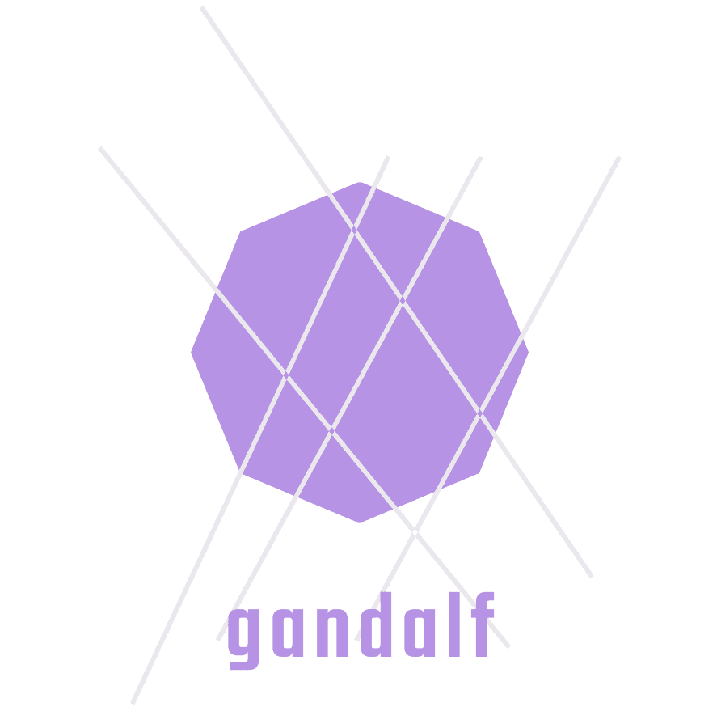

<!-- PROJECT LOGO -->

  
  

    Forensics artefact acquisition script(s) to be used in conjunction with elrond.
      
    
    
    <a href="https://github.com/ezaspy/gandalf/network/members">
      
    
    
    
    
    </a>
      
    </a>
    
      
  

<!-- TABLE OF CONTENTS -->

## Table of Contents

- [About the Project](#about-the-project)
- [Prerequisites](#prerequisites)
- [Usage](#usage)
- [Contributing](#contributing)
- [License](#license)
- [Contact](#contact)
- [Acknowledgements](#acknowledgements)

  

<!-- ABOUT THE PROJECT -->

## About The Project

gandalf has been created to help fellow digitial forensicators with the live collection of forensic artefacts from a Windows, Linux and masOS hosts. Depending on the host OS, either gandalf.ps1 or gandalf.py will be required; to ensure compatibility for Windows and \*nix hosts respectively.
gandalf will collect all commonly utilised forensic artefacts but it will not process them - this is handled by the script [elrond](https://github.com/ezaspy/elrond), which converts all of the artefacts to either JSON or CSV and can then stand up an on-the-fly Splunk or elastic stack instance whilst mapping evidence within those artefacts to the MITRE ATT&CK® Framework.
   

<!-- Prerequisites -->

## Prerequisites

The only prequisites for gandalf is permissions. You must have admin rights to obtain the necessary artefacts from remote hosts within your environment. 
  

<!-- USAGE EXAMPLES -->

## Usage

### Windows 

`powershell.exe .\Gandalf.ps1 [-h] [-LR] <case_id> <output_directory>`  

### Linux/macOS

`python3 gandalf.py [-h] [-LR] <case_id> <output_directory>` 

   

<!-- CONTRIBUTING -->

## Contributing

Contributions are what make the open source community such an amazing place to be learn, inspire, and create. Any contributions you make are **greatly appreciated**.

1. Fork the Project
2. Create your Feature Branch (`git checkout -b feature/AmazingFeature`)
3. Commit your Changes (`git commit -m 'Add some AmazingFeature'`)
4. Push to the Branch (`git push origin feature/AmazingFeature`)
5. Open a Pull Request
      

<!-- LICENSE -->

## License

Distributed under the MIT License. See [LICENSE](https://github.com/ezaspy/gandalf/LICENSE.txt) for more information.
   

<!-- CONTACT -->

## Contact

ezaspy - ezaspython (at) gmail (dot) com

Project Link: [https://github.com/ezaspy/gandalf](https://github.com/ezaspy/gandalf)

Other Projects: [https://github.com/ezaspy/](https://github.com/ezaspy/)
   

<!-- ACKNOWLEDGEMENTS -->

## Acknowledgements

- [Jason Fossen](https://blueteampowershell.com/) 
- [SANS](https://www.sans.org)

- Documentation
  - [Best-README-Template](https://github.com/othneildrew/Best-README-Template)
  - [hatchful](https://hatchful.shopify.com)
  - [Image Shields](https://shields.io)
- Theme &amp; Artwork
  - [J.R.R. Tolkien](https://en.wikipedia.org/wiki/J._R._R._Tolkien)
  - [Peter Jackson](https://twitter.com/ReaPeterJackson)
  - [ASCII Text Generator](https://textkool.com/en/ascii-art-generator?hl=default&vl=default&font=Red%20Phoenix&text=Your%20text%20here%20)
  - [ASCII Art Generator](https://www.ascii-art-generator.org)
  - [ASCII World](http://www.asciiworld.com/-Lord-of-the-Rings-.html)

<!-- MARKDOWN LINKS & IMAGES -->
<!-- https://www.markdownguide.org/basic-syntax/#reference-style-links -->

[gandalf-screenshot]: images/screenshot.png
